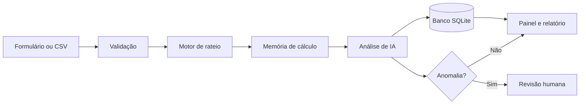

# EV ChargeOps — Sprint 2

**Enterprise Challenge 2026 — GoodWe + FIAP**

**Aluno:** Pedro Henrique Canavezi — RM 570298

O EV ChargeOps é um protótipo para controlar recargas de veículos elétricos em
locais compartilhados. Ele registra cada sessão, calcula quanto o usuário deve
pagar, guarda a memória do cálculo e usa inteligência artificial para apontar
dados que precisam de revisão.

O protótipo usa o carregador **GoodWe HCA G2** como referência do desafio. A
integração direta com o equipamento e com o SEMS Portal não foi simulada como
se estivesse pronta. Como não há acesso ao carregador, à conta de testes ou a
uma API confirmada, o MVP recebe dados por formulário e por arquivo CSV.

## O que foi implementado

- painel web com indicadores de sessões, consumo, valores e alertas;
- cadastro manual de uma sessão de recarga;
- importação de várias sessões por CSV;
- banco SQLite criado automaticamente;
- cálculo de energia, taxa operacional, desconto e valor total;
- memória de cálculo simples para auditoria;
- módulo de IA integrado ao registro e à importação;
- lista de sessões que precisam de revisão humana;
- previsão simples de demanda para os próximos sete dias;
- relatório CSV para download;
- dados de exemplo, testes automatizados e evidências de execução.

## Como executar no Windows

### Opção rápida

1. Instale o [Python 3.11 ou superior](https://www.python.org/downloads/).
2. Baixe ou clone este repositório.
3. Abra a pasta do projeto.
4. Clique duas vezes em `executar.bat`.
5. O navegador abrirá o endereço `http://localhost:8501`.

Na primeira execução, o arquivo instala Streamlit e pandas. Depois, basta abrir
`executar.bat` novamente.

### Pelo terminal

```bash
python -m venv .venv

# Windows
.venv\Scripts\activate

# Linux ou macOS
source .venv/bin/activate

python -m pip install -r requirements.txt
python -m streamlit run app.py
```

O sistema carrega os dados de exemplo automaticamente quando o banco está
vazio. Para voltar ao estado inicial:

```bash
python scripts/resetar_banco.py
```

## Fluxo principal



Uma sessão passa pela mesma sequência, seja digitada no painel ou importada por
CSV. O valor enviado no CSV não é aceito como verdade: o sistema recalcula tudo
com a regra oficial do projeto.

## Regra de rateio

```text
valor_energia = kWh consumido × tarifa por kWh
valor_percentual = valor_energia × percentual operacional
valor_taxa = taxa fixa + valor_percentual
valor_total = valor_energia + valor_taxa - desconto
```

O código usa `Decimal` e arredondamento financeiro `ROUND_HALF_UP`. Cada parte
monetária é arredondada para dois centavos. Sessões pendentes não são cobradas,
mesmo que exista taxa fixa.

Exemplo com 18,4 kWh, tarifa de R$ 0,92, taxa fixa de R$ 2,00 e taxa operacional
de 12%:

```text
Energia: 18,4 × 0,92 = R$ 16,93
Percentual: 12% de 16,93 = R$ 2,03
Taxa total: 2,00 + 2,03 = R$ 4,03
Valor final: 16,93 + 4,03 = R$ 20,96
```

## Módulo de inteligência artificial

A IA não foi colocada apenas para aparecer no projeto. Ela participa do fluxo
principal: **toda sessão registrada ou importada é analisada antes de aparecer
no painel**. O resultado fica salvo no banco junto com a sessão.

### Dados usados pela IA

Cada sessão concluída é transformada em quatro características:

1. energia consumida em kWh;
2. duração em horas;
3. potência média estimada;
4. horário de início.

### Como a análise funciona

O projeto usa um detector de anomalias baseado em **KNN não supervisionado**.
Ele normaliza os quatro valores e mede a distância entre a nova sessão e as
três sessões históricas mais parecidas. Quanto maior a distância, maior o score
de risco.

O KNN é combinado com regras operacionais para identificar casos claros:

- sessão fechada sem horário final;
- consumo zero após muito tempo conectado;
- duração acima de 12 horas;
- consumo acima de 80 kWh;
- potência média acima do limite de referência de 22 kW.

Um score a partir de 60 marca a sessão para revisão. A IA **não muda tarifa,
desconto ou valor total**. A decisão financeira continua sob controle humano.

O algoritmo foi implementado no próprio projeto, sem API externa e sem chave
secreta. Isso permite executar e explicar todo o processo durante o pitch.

## Telas do protótipo

O menu lateral possui cinco áreas:

- **Visão geral:** indicadores, consumo por usuário e alertas recentes;
- **Nova sessão:** cadastro manual e cálculo imediato;
- **Importar CSV:** carga em lote com nova análise dos dados;
- **Sessões e rateio:** filtros, relatório e memória de cálculo;
- **Módulo de IA:** anomalias, motivos e previsão de demanda.

## Evidências de funcionamento

Para executar o fluxo completo fora da interface:

```bash
python scripts/gerar_evidencias.py
```

O comando cria:

- `evidencias/resultado-demo.md`: resumo da importação, valores e alertas;
- `evidencias/sessoes-processadas.csv`: relatório gerado pelo sistema.
- `evidencias/validacao.md`: registro dos testes do protótipo.

As evidências atuais estão na pasta [`evidencias`](evidencias/).

## Testes

Execute:

```bash
python -m unittest discover -s tests -v
python scripts/validar_interface.py
```

Os testes verificam:

- cálculo e arredondamento do rateio;
- regra de sessão pendente;
- limite de desconto;
- detecção de potência impossível;
- sessão fechada sem horário final;
- previsão de demanda;
- registro no SQLite;
- importação CSV com recálculo do total.

O segundo comando abre as cinco páginas em modo de teste e envia uma sessão
por um banco temporário. Ele confirma o funcionamento do formulário sem mexer
nos dados locais do usuário.

## Estrutura do projeto

```text
ev-chargeops/
├── app.py                         Painel Streamlit
├── executar.bat                   Inicialização no Windows
├── requirements.txt               Dependências
├── assets/data/
│   └── exemplos-sessoes.csv       Base de demonstração
├── src/
│   ├── database.py                Banco SQLite
│   ├── ia.py                      Anomalias e previsão
│   ├── rateio.py                  Regras financeiras
│   └── services.py                Fluxo da aplicação
├── tests/                         Testes automatizados
├── scripts/
│   ├── gerar_evidencias.py
│   ├── resetar_banco.py
│   └── validar_interface.py
├── evidencias/                    Resultados e registros de validação
└── docs/                          Arquitetura e decisões técnicas essenciais
```

## Decisões técnicas

### Python e Streamlit

A Sprint 1 deixou a escolha da tecnologia em aberto. Para a Sprint 2 foi usado
Python porque a regra de rateio, o módulo de IA e os testes ficam simples de
ler. Streamlit permite mostrar um protótipo navegável sem criar um front-end
separado.

### SQLite

O SQLite foi escolhido porque funciona sem servidor e deixa a demonstração
mais segura no computador da faculdade. O banco pode ser trocado por PostgreSQL
em uma versão futura sem mudar a regra de negócio.

### CSV antes da integração GoodWe

A Sprint 1 previa CSV como entrada inicial. Essa decisão foi mantida porque não
há acesso técnico confirmado ao HCA G2 ou ao SEMS Portal. Inventar uma API daria
uma falsa impressão de integração.

### IA local

O detector KNN foi escrito no próprio código. Ele não depende de internet,
serviço pago ou respostas de um modelo externo. O resultado é reproduzível e
fácil de demonstrar.

## Limites atuais

- não existe comunicação real com o HCA G2;
- não há pagamento real;
- o sistema não substitui validação jurídica, elétrica ou regulatória;
- a previsão melhora quando existe um histórico maior;
- placa, RFID e dados de usuário exigem controle de acesso em produção;
- a potência de 22 kW é usada apenas como referência do cenário de teste.

## Próximas evoluções

- validar uma forma oficial de exportação ou integração com SEMS Portal;
- adicionar autenticação e perfis de acesso;
- trocar SQLite por PostgreSQL em uma implantação real;
- guardar histórico de alterações de tarifa;
- receber eventos do carregador em tempo real;
- treinar o detector com uma base maior de sessões reais.

As decisões da Sprint 1 que orientaram a implementação estão resumidas neste
README e na pasta [`docs`](docs/). O pacote contém apenas a documentação
necessária para compreender e executar o protótipo da Sprint 2.
